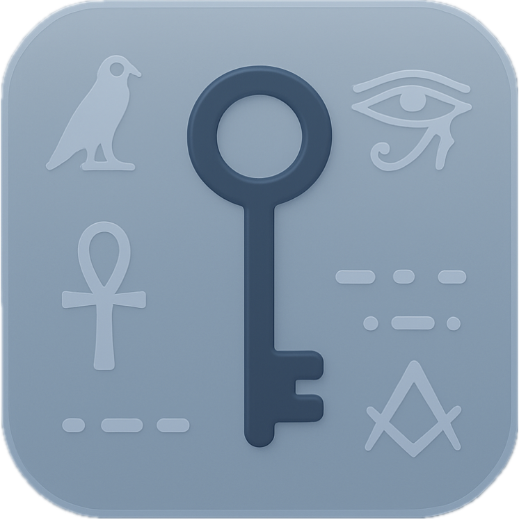

<p align="center">
  
</p>

<h1 align="center">Occultum</h1>

<p align="center">
  Texte kodieren, dekodieren und eigene Geheimsprachen verwalten — für Android, iOS und Web.
</p>

## Funktionen

- **Kodieren & Dekodieren** — Text in eine von vielen Sprachen übersetzen oder zurückübersetzen
- **Sprachen verwalten** — Alle verfügbaren Sprachen durchsuchen und Details anzeigen
- **Eigene Sprachen erstellen** — Buchstaben-Zuordnungen für a–z frei definieren
- **Viele Standard-Sprachen** — u. a. Caesar-Verschlüsselungen, Emoji-Zahlen, Ziffern, Braille, Griechisch und mehr
- **Teilen & Kopieren** — Kodierte Texte direkt teilen oder in die Zwischenablage kopieren
- **Einstellungen** — App-Version, GitHub-Link und Zurücksetzen eigener Sprachen

## Tech-Stack

| Bereich | Technologie |
|---|---|
| Framework | [Expo](https://expo.dev) SDK 54 |
| UI | React Native 0.81, React 19 |
| Navigation | [Expo Router](https://docs.expo.dev/router/introduction/) (file-based) |
| Speicher | AsyncStorage |
| Plattformen | Android, iOS, Web |

## Voraussetzungen

- [Node.js](https://nodejs.org/) (LTS empfohlen)
- npm (im Lieferumfang von Node.js)
- Optional für mobile Geräte: [Expo Go](https://expo.dev/go) oder ein Emulator (Android Studio / Xcode)

## App lokal starten

1. Repository klonen und ins Projektverzeichnis wechseln:

   ```bash
   git clone https://github.com/AntonMaxMittmann/Occultum.git
   cd Occultum
   ```

2. Abhängigkeiten installieren:

   ```bash
   npm install
   ```

3. Entwicklungsserver starten:

   ```bash
   npx expo start
   ```

4. App öffnen — im Terminal erscheinen Optionen für:
   - **Web** — `w` drücken oder im Browser öffnen
   - **Android** — `a` drücken (Emulator) oder QR-Code mit Expo Go scannen
   - **iOS** — `i` drücken (Simulator, nur macOS) oder QR-Code mit Expo Go scannen

Alternativ direkt für eine Plattform starten:

```bash
npm run web      # Web
npm run android  # Android
npm run ios      # iOS (nur macOS)
```

## Projektstruktur

```
app/
├── (tabs)/          # Tab-Navigation (Kodieren, Sprachen, Einstellungen)
├── components/      # CodePage, DecodePage
├── context/         # React Context (Suche)
├── data/            # Standard-Sprachen
└── assets/          # Icons und Bilder
```

## Lizenz

Dieses Projekt ist Open Source. Beiträge und Issues sind auf [GitHub](https://github.com/AntonMaxMittmann/Occultum) willkommen.
